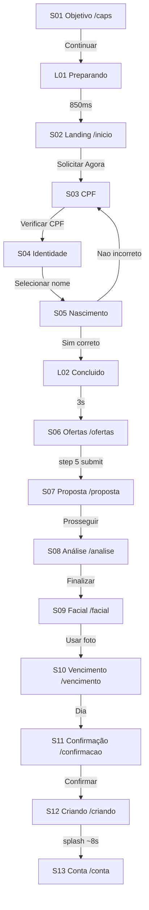

# SDD 02 — User Flow

## Diagrama



## Regras de navegação

| De | Para | Condição |
|----|------|----------|
| S01 | L01 | Objetivo selecionado + click Continuar |
| L01 | S02 | Timeout 850ms |
| S02 | S03 | Click Solicitar Agora ou Simular header |
| S03 | S04 | CPF com 11 dígitos + dígitos verificadores válidos |
| S04 | S05 | Nome selecionado |
| S05 | L02 | Click "Sim, está correto" |
| S05 | S03 | Click "Não, está incorreto" |
| L02 | S06 | Timeout 3s |
| S06 | S07 | Step 5 válido + success 1.5s |
| S07 | S08 | Click Prosseguir com Ingrid Torres |
| S08 | S09 | Click Finalizar Cadastro |
| S09 | S10 | Click Usar esta foto |
| S10 | S11 | Li e Concordo + dia escolhido |
| S11 | S12 | Form válido + loading 1.5s |
| S12 | S13 | Splash concluído (~8,4s) |

## Persistência (FlowContext)

```typescript
interface FlowState {
  objective: 'pessoal' | 'negocio' | null;
  cpf: string;
  nome: string;
  motherName: string;
  birthDate: string;
  loanAmount: number;
  verificationStep: 1 | 2 | 3 | 4;
  ofertasStep: 1 | 2 | 3 | 4 | 5;
  ofertasData: { /* ... */ };
  propostaAccepted: boolean;
  analiseData: { /* PIX, parcelas, etc. */ };
  facialVerified: boolean;
  facialPhoto: string;
  dueDate: number | null;
  email: string;
  phone: string;
  contactComplete: boolean;
  saqueComplete: boolean;
}
```

Salvo em `localStorage` key `supersim-flow`.

UTMs em `localStorage` key `supersim-utms`.

## Progress bar por tela

| Tela | Progress |
|------|----------|
| S01 | 78% (fixo animado) |
| S03 | 25% |
| S04 | 50% |
| S05 | 75% |
| L02 | 100% |
| S06 | step/5 × 100% |
