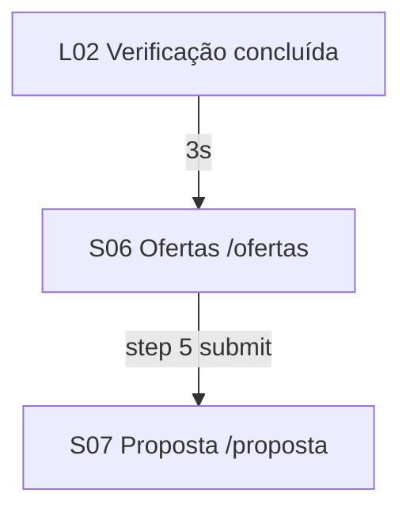

# SDD 05 — Product Overview Fase 2

## Objetivo

Estender o funil mockado com informações do empréstimo (`/ofertas`), página de proposta (`/proposta`), UTMs e redirect de back.

## Escopo Fase 2

- S06 Ofertas — wizard 5 steps (Finalidade, Ocupação, Renda, Escolaridade, CPF)
- S07 Proposta — especialista Ingrid Torres (mock)
- L02 → `/ofertas` após 3s
- UTM persistence em localStorage
- Back redirect em `/inicio` → `/caps`
- Header com nome + CPF mascarado

## Rotas novas

| Rota | Original | Tela |
|------|----------|------|
| `/ofertas` | `/3/` | Informações do Empréstimo |
| `/proposta` | `/4/` | Termos / Proposta |

## Fluxo atualizado

## Fora de escopo

- APIs reais
- Analytics pixels
- Deploy produção
- Páginas pós `/4/` do original
