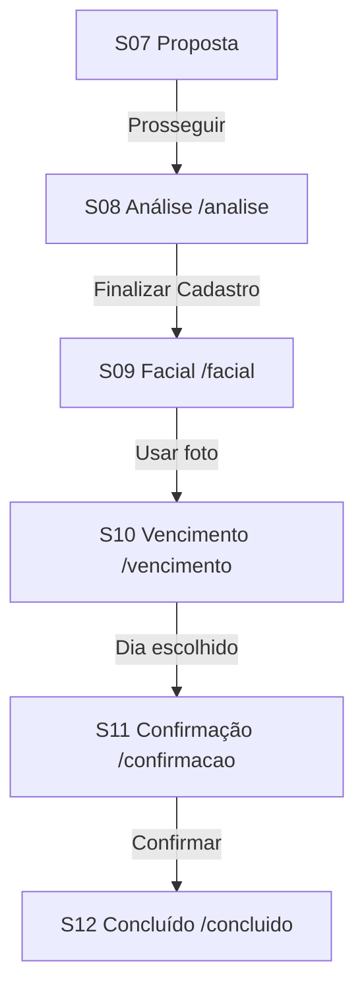

# SDD 07 — Fase 3 Overview

## Objetivo

Completar o funil pós-proposta com chat de análise, verificação facial, vencimento e confirmação de contato.

## Escopo Fase 3

| SDD | Rota | Original |
|-----|------|----------|
| S08 Análise | `/analise` | `/5/` |
| S09 Facial | `/facial` | `/6/` |
| S10 Vencimento | `/vencimento` | `/7/` |
| S11 Confirmação | `/confirmacao` | `/8/` |
| S12 Concluído | `/concluido` | `/criando/` (mock local) |

## Fluxo

## Fora de escopo

- Câmera real / API de biometria
- Checkout externo pós `/8/`
- Analytics pixels
